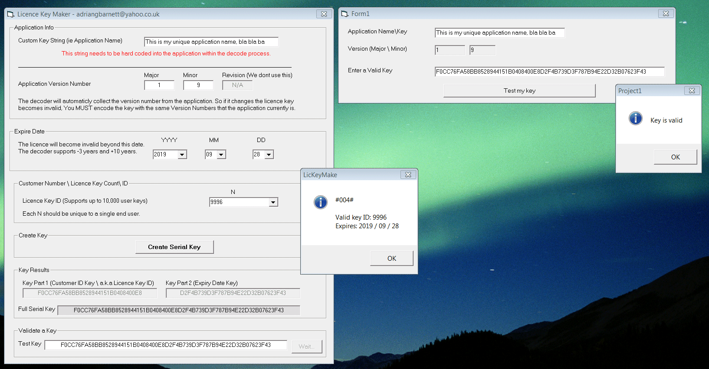



## Serial Key Creator

### Description

This tool generates between 1 and 10,000 unique Serial key&#8217;s 64 characters in length (512 bit) which is derived from MD5 digest. Within the encoded Serial key is an expiry date. The decoder determines if a key is valid and\or expired. The encoded MD5 hash key is non reversible, so to decode, the decoder function needs to recreate the Serial key by sending specific strings to MD5, and then comparing the output hash against the Serial key (hash) that the end-user has submitted to unlock the application. 10,000 keys take approx 3 deconds to decode a key.
 
### More Info
 

             |
---                |---
**Submitted On**   |2009-09-18 12:31:58
**By**             |[adriangb](https://github.com/Planet-Source-Code/PSCIndex/blob/master/ByAuthor/adriangb.md)
**Level**          |Intermediate
**User Rating**    |5.0 (20 globes from 4 users)
**Compatibility**  |VB 6\.0
**Category**       |[Encryption](https://github.com/Planet-Source-Code/PSCIndex/blob/master/ByCategory/encryption__1-48.md)
**World**          |[Visual Basic](https://github.com/Planet-Source-Code/PSCIndex/blob/master/ByWorld/visual-basic.md)
**Archive File**   |[Serial\_Key2162959182009\.zip](https://github.com/Planet-Source-Code/adriangb-serial-key-creator__1-72470/archive/master.zip)

